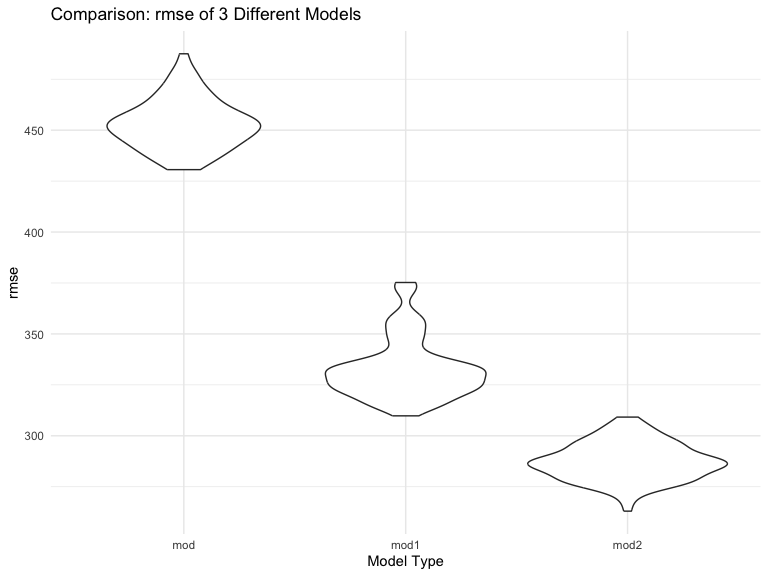

P8105_hw6_yz4434
================
Yingting Zhang
2023-11-28

``` r
library(tidyverse)
library(modelr)
library(dplyr)
library(ggplot2)
```

### Problem 1

In the data cleaning code below we create a `city_state` variable,
change `victim_age` to numeric, modifiy victim_race to have categories
white and non-white, with white as the reference category, and create a
`resolution` variable indicating whether the homicide is solved. Lastly,
we filtered out the following cities: Tulsa, AL; Dallas, TX; Phoenix,
AZ; and Kansas City, MO; and we retained only the variables
`city_state`, `resolution`, `victim_age`, `victim_sex`, and
`victim_race`.

``` r
homicide_df = 
  read_csv("data/homicide-data.csv", na = c("", "NA", "Unknown")) |> 
  mutate(
    city_state = str_c(city, state, sep = ", "),
    victim_age = as.numeric(victim_age),
    resolution = case_when(
      disposition == "Closed without arrest" ~ 0,
      disposition == "Open/No arrest"        ~ 0,
      disposition == "Closed by arrest"      ~ 1)
  ) |> 
  filter(victim_race %in% c("White", "Black")) |> 
  filter(!(city_state %in% c("Tulsa, AL", "Dallas, TX", "Phoenix, AZ", "Kansas City, MO"))) |> 
  select(city_state, resolution, victim_age, victim_sex, victim_race)
```

    ## Rows: 52179 Columns: 12
    ## ── Column specification ────────────────────────────────────────────────────────
    ## Delimiter: ","
    ## chr (8): uid, victim_last, victim_first, victim_race, victim_sex, city, stat...
    ## dbl (4): reported_date, victim_age, lat, lon
    ## 
    ## ℹ Use `spec()` to retrieve the full column specification for this data.
    ## ℹ Specify the column types or set `show_col_types = FALSE` to quiet this message.

Next we fit a logistic regression model using only data from Baltimore,
MD. We model `resolved` as the outcome and `victim_age`, `victim_sex`,
and `victim_race` as predictors. We save the output as `baltimore_glm`
so that we can apply `broom::tidy` to this object and obtain the
estimate and confidence interval of the adjusted odds ratio for solving
homicides comparing non-white victims to white victims.

``` r
baltimore_glm = 
  filter(homicide_df, city_state == "Baltimore, MD") |> 
  glm(resolution ~ victim_age + victim_sex + victim_race, family = binomial(), data = _)

baltimore_glm |> 
  broom::tidy() |> 
  mutate(
    OR = exp(estimate), 
    OR_CI_upper = exp(estimate + 1.96 * std.error),
    OR_CI_lower = exp(estimate - 1.96 * std.error)) |> 
  filter(term == "victim_sexMale") |> 
  select(OR, OR_CI_lower, OR_CI_upper) |>
  knitr::kable(digits = 3)
```

|    OR | OR_CI_lower | OR_CI_upper |
|------:|------------:|------------:|
| 0.426 |       0.325 |       0.558 |

Below, by incorporating `nest()`, `map()`, and `unnest()` into the
preceding Baltimore-specific code, we fit a model for each of the
cities, and extract the adjusted odds ratio (and CI) for solving
homicides comparing non-white victims to white victims. We show the
first 5 rows of the resulting dataframe of model results.

``` r
model_results = 
  homicide_df |> 
  nest(data = -city_state) |> 
  mutate(
    models = map(data, \(df) glm(resolution ~ victim_age + victim_sex + victim_race, 
                             family = binomial(), data = df)),
    tidy_models = map(models, broom::tidy)) |> 
  select(-models, -data) |> 
  unnest(cols = tidy_models) |> 
  mutate(
    OR = exp(estimate), 
    OR_CI_upper = exp(estimate + 1.96 * std.error),
    OR_CI_lower = exp(estimate - 1.96 * std.error)) |> 
  filter(term == "victim_sexMale") |> 
  select(city_state, OR, OR_CI_lower, OR_CI_upper)

model_results |>
  slice(1:5) |> 
  knitr::kable(digits = 3)
```

| city_state      |    OR | OR_CI_lower | OR_CI_upper |
|:----------------|------:|------------:|------------:|
| Albuquerque, NM | 1.767 |       0.831 |       3.761 |
| Atlanta, GA     | 1.000 |       0.684 |       1.463 |
| Baltimore, MD   | 0.426 |       0.325 |       0.558 |
| Baton Rouge, LA | 0.381 |       0.209 |       0.695 |
| Birmingham, AL  | 0.870 |       0.574 |       1.318 |

Below we generate a plot of the estimated ORs and CIs for each city,
ordered by magnitude of the OR from smallest to largest. From this plot
we see that most cities have odds ratios that are smaller than 1,
suggesting that crimes with male victims have smaller odds of resolution
compared to crimes with female victims after adjusting for victim age
and race. This disparity is strongest in New yrok. In roughly half of
these cities, confidence intervals are narrow and do not contain 1,
suggesting a significant difference in resolution rates by sex after
adjustment for victim age and race.

``` r
model_results |> 
  mutate(city_state = fct_reorder(city_state, OR)) |> 
  ggplot(aes(x = city_state, y = OR)) + 
  geom_point() + 
  geom_errorbar(aes(ymin = OR_CI_lower, ymax = OR_CI_upper)) + 
  theme(axis.text.x = element_text(angle = 90, hjust = 1))
```


### Problem 2

``` r
weather_df = 
  rnoaa::meteo_pull_monitors(
    c("USW00094728"),
    var = c("PRCP", "TMIN", "TMAX"), 
    date_min = "2022-01-01",
    date_max = "2022-12-31") |>
  mutate(
    name = recode(id, USW00094728 = "CentralPark_NY"),
    tmin = tmin / 10,
    tmax = tmax / 10) |>
  select(name, id, everything())
```

    ## using cached file: /Users/demiwang/Library/Caches/org.R-project.R/R/rnoaa/noaa_ghcnd/USW00094728.dly

    ## date created (size, mb): 2023-10-08 19:41:14.184812 (0.343)

    ## file min/max dates: 2021-01-01 / 2023-10-31

Use 5000 bootstrap samples and, for each bootstrap sample, produce
estimates of these two quantities. Plot the distribution of your
estimates, and describe these in words. Using the 5000 bootstrap
estimates, identify the 2.5% and 97.5% quantiles to provide a 95%
confidence interval for r̂ 2 and log(β̂ 0∗β̂ 1)

``` r
# Create r square and log beta
boot_sample = function(df) {
  
  sample_frac(df, replace = TRUE)
  
}

results = 
  tibble(strap_number = 1:5000) |> 
  mutate(
    strap_sample = map(strap_number, \(i) boot_sample(weather_df)),
    models = map(strap_sample, \(df) lm(tmax ~ tmin + prcp, data = df)),
    result_r = map(models, broom::glance),
    result_log_beta = map(models, broom::tidy)
  ) |> 
  unnest(result_log_beta) |> select(term,estimate, result_r) |> 
  unnest(result_r) |> select(term, estimate, r.squared) |> 
    pivot_wider(
    names_from = term,
    values_from = estimate
  ) |> 
  rename(
    beta1 = tmin,
    beta2 = prcp
  ) |> mutate(
    log_b1_b2 = log(beta1*beta2)
  )
```

#### Distribution of r square and log(β̂ 1∗β̂ 2)

``` r
# R square distribution

r_squared_plot = 
  results|> 
  ggplot(aes(x = r.squared)) + geom_density()+
  labs(
    title = "The distribution of R hat square",
    x = "R hat square",
    y = "Density"
  )

r_squared_plot
```


Description: According to the output of density, we can see that the
plot shows a unimodal distribution, meaning there is one peak, and it
seems to be normally distributed around the peak. The highest density of
R-squared values is just above 0.92, indicating that most of the
R-squared values from the bootstrap samples or model runs are clustered
around this region. The density smoothly decreases as the values move
away from the peak on either side.

``` r
# log(β̂ 1∗β̂ 2) distribution

log_beta_plot = 
  results |> 
  ggplot(aes(x = log_b1_b2)) + geom_density()+
  labs(
    title = "The distribution of log(β̂ 1∗β̂ 2)",
    x = "log(β̂ 1∗β̂ 2)",
    y = "Density"
  )

log_beta_plot
```


Description: The plot indicates that the logarithmic values range
approximately from -12 to -4, which looks like a left-skewed
distribution. The distribution has a single peak, suggesting that most
of the log-transformed products of β1 and β2 are concentrated around
this peak. The peak of the distribution is around -6, which is where the
highest density of observations is found. The density decreases as the
values move away from the peak on either side.

#### Construct Confidence Interval

``` r
ci_results = 
  results|> select(r.squared, log_b1_b2) |> 
  pivot_longer(
    r.squared:log_b1_b2,
    names_to = "type",
    values_to = "estimate"
  ) |> 
  group_by(type) |> 
  summarize(
    ci_lower = quantile(estimate, 0.025, na.rm = TRUE),
    ci_upper = quantile(estimate, 0.975, na.rm = TRUE)
  )

ci_results
```

    ## # A tibble: 2 × 3
    ##   type      ci_lower ci_upper
    ##   <chr>        <dbl>    <dbl>
    ## 1 log_b1_b2   -8.94    -4.57 
    ## 2 r.squared    0.889    0.940

### Problem 3

Import Data

``` r
birthweight_df = 
  read_csv("data/birthweight.csv", na = c("", "NA", "Unknown")) |> 
  mutate(
    babysex = as.factor(babysex),
    babysex = recode(babysex, "1" ="male", "2"="female" ),
    mrace = as.factor(mrace),
    mrace = recode(mrace, "1" ="White", "2"="Black", "3" = "Asian"),
    frace = as.factor(frace),
    frace = recode(frace, "1" ="White", "2"="Black", "3" = "Asian"))
```

    ## Rows: 4342 Columns: 20
    ## ── Column specification ────────────────────────────────────────────────────────
    ## Delimiter: ","
    ## dbl (20): babysex, bhead, blength, bwt, delwt, fincome, frace, gaweeks, malf...
    ## 
    ## ℹ Use `spec()` to retrieve the full column specification for this data.
    ## ℹ Specify the column types or set `show_col_types = FALSE` to quiet this message.

``` r
# Check for NA values
sum(is.na(birthweight_df))
```

    ## [1] 0

Description: According to this dataset, we can see that there are only
three variable are categorical variables, including the sex of babies
and races from patients. In this case, I would like to change them into
factor with showing them in different level of characters. Besides that,
I delete all redundant categories in race which doesn’t occur in this
dataset. After checking this dataset, there is no missing data.

#### Propose a regression model for birthweight

The hypothesis I would like to create is to explore whether the factors
of mother, including mother’s pre-pregnancy weight, weight gain during
pregnancy, the age at delivery, with babies’ race which depends on
parents’ races and the level of family income which directly determines
the nutritional intake of the mother during pregnancy.Smoking during
pregnancy might affect birthweight as well.

``` r
# Create my models based on the hypothesis above
mod = lm(bwt ~ ppwt + wtgain + momage + frace + mrace + 
           fincome + smoken, data = birthweight_df)
```

``` r
birthweight_df = 
  birthweight_df |> 
  add_predictions(mod) |> 
  add_residuals(mod)

my_plot = birthweight_df |> 
  ggplot(aes(x = pred, y = resid)) +
  geom_point() +
  xlab("Fitted Values") +
  ylab("Residuals") +
  ggtitle("Residuals vs Fitted Values")

my_plot
```


#### Comparing models

``` r
# Create the models
mod1 = lm(bwt ~ blength + gaweeks, data = birthweight_df)
mod2 = lm(bwt ~ bhead * blength * babysex, data = birthweight_df)
```

``` r
# Cross-validation
cv_df = 
  crossv_mc(birthweight_df, 100) |> 
    mutate(
    train = map(train, as_tibble),
    test = map(test, as_tibble)
  )

# Apply each model to all training datasets, and evaluate on all testing datasets
cv_results =
  cv_df |> 
  mutate(
    mod = map(train, \(birthweight_df) lm(bwt ~ ppwt + wtgain + momage + frace + mrace + fincome + smoken, data = birthweight_df)),
    mod1 = map(train, \(birthweight_df) lm(bwt ~ blength + gaweeks, data = birthweight_df)),
    mod2 = map(train, \(df) lm(bwt ~ bhead * blength * babysex, data = birthweight_df))
  ) |> 
  mutate(
    rmse_mod = map2_dbl(mod, test, \(mod, df) rmse(mod, df)),
    rmse_mod1 = map2_dbl(mod1, test, \(mod, df) rmse(mod, df)),
    rmse_mod2 = map2_dbl(mod2, test, \(mod, df) rmse(mod, df))
  )
```

``` r
comparison = cv_results |> 
  select(starts_with("rmse")) |> 
  pivot_longer(
    everything(),
    names_to = "model_type",
    values_to = "rmse",
    names_prefix = "rmse_"
  ) 

comparison_mean = 
  comparison|> 
  group_by(model_type) |> 
  summarize(m_rmse = mean(rmse))

comparison_mean
```

    ## # A tibble: 3 × 2
    ##   model_type m_rmse
    ##   <chr>       <dbl>
    ## 1 mod          451.
    ## 2 mod1         333.
    ## 3 mod2         287.

``` r
# Comparing models in plots

comparison |> 
  ggplot(aes(x = model_type, y = rmse)) +
  geom_violin() +
  labs(
    title = "Comparison: rmse of 3 Different Models",
    x = "Model Type"
  )
```


